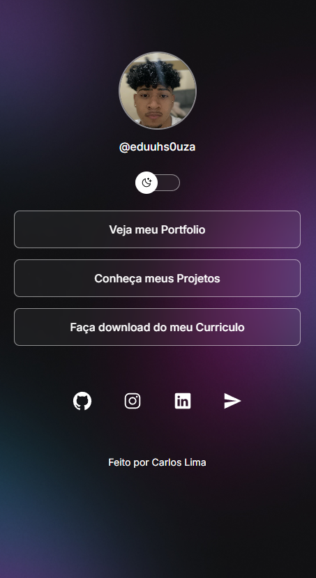

# 🔗 DevLinks

Projeto **DevLinks** inspirado no modelo da Rocketseat, desenvolvido para centralizar links importantes em uma única página, com suporte a **modo claro e escuro**, design responsivo e visual moderno.

---

## 📸 Preview




---

## 🚀 Funcionalidades

- 🌙 Alternância entre **modo claro e escuro**
- 📱 **Layout responsivo** (mobile e desktop)
- 🔗 Centralização de links importantes
- 📥 Botão para **download de currículo**
- 🌐 Ícones de redes sociais
- 🎨 Interface moderna com CSS variables

---

## 🛠️ Tecnologias Utilizadas

- **HTML5**
- **CSS3**
- **JavaScript**
- **IonIcons**
- **Google Fonts (Inter)**


---

## ⚙️ Como executar o projeto


1. Clone o repotório:

```bash
git clone https://github.com/eduuhs0uza/devlinks.git
Acesse a pasta:

bash
Copiar código
cd devlinks
Abra o arquivo index.html no navegador.

🌐 Acesse Online
🔗 Portfolio: https://eduuhs0uza.github.io/Portfolio/
🔗 GitHub: https://github.com/eduuhs0uza

📄 Download do Currículo
Disponível diretamente na página através do botão de download.

🧠 Aprendizados
Manipulação de classes no DOM

Uso de CSS Variables

Criação de tema dinâmico

Estruturação semântica HTML

Responsividade com media queries

👨‍💻 Autor
Carlos Eduardo Souza de Lima
🎓 Análise e Desenvolvimento de Sistemas

🔗 GitHub: https://github.com/eduuhs0uza
🔗 LinkedIn: https://www.linkedin.com/in/carlos-eduardo-souza-de-lima-3b2665336/
```
